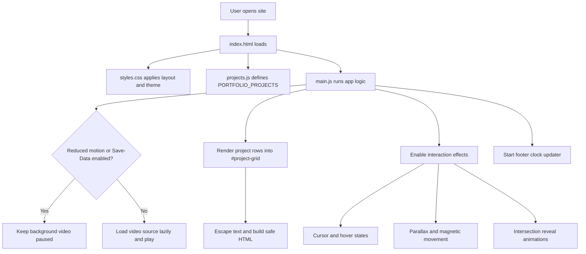
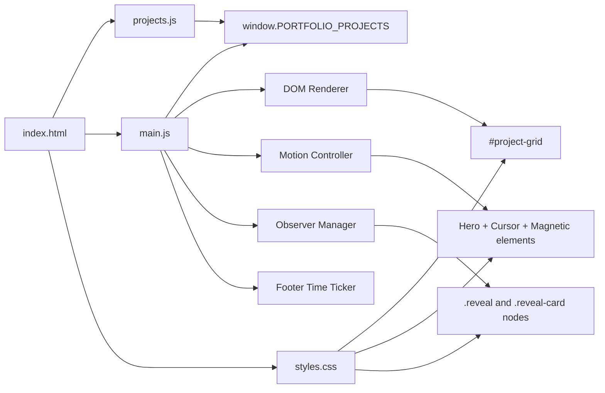

# Portfolio Site

Hi, I am Ranjan. This repo is my hand-built portfolio site.

It is a plain HTML, CSS, and JavaScript project that lists my work, keeps performance in mind, and adds small interaction details like reveal animations, magnetic buttons, and a custom cursor on supported devices.

## Live website

- Website: https://konseptt.github.io/portfolio-site/

## Repository details to set on GitHub

Use these values in **Settings -> General**:

- Description: Personal developer portfolio with selected projects, custom UI interactions, and lightweight front-end performance optimizations.
- Website: https://syllabuscal.ranjansharma.info.np
- Topics: `portfolio html css javascript github-pages front-end web-performance`

## What is in this repo

- `index.html` - page structure, SEO meta tags, JSON-LD, and sections.
- `styles.css` - visual design, layout, animation states, and responsive behavior.
- `projects.js` - project catalog data that powers the work grid.
- `main.js` - runtime behavior for rendering, motion effects, and utility interactions.
- `assets/` - thumbnails, favicon, and media assets.

## Site flowchart

## Runtime architecture diagram

## Data model for projects

Every entry in `projects.js` supports:

- `title`
- `tagline`
- `tags[]`
- `year`
- `url`
- `accent`
- `thumb`
- Optional image tuning fields: `thumbAspect`, `thumbImgWidth`, `thumbImgHeight`

## How I update content

1. Add or edit project objects in `projects.js`.
2. Refresh the page and confirm card layout, links, and tags.
3. Keep copy style consistent with the existing voice.
4. Check metadata in `index.html` when major content changes.

## Notes

- External project links open in a new tab with safe rel attributes.
- Project text is escaped before insertion to avoid unsafe HTML injection.
- The first thumbnail is loaded with high priority and the rest use lazy loading.
